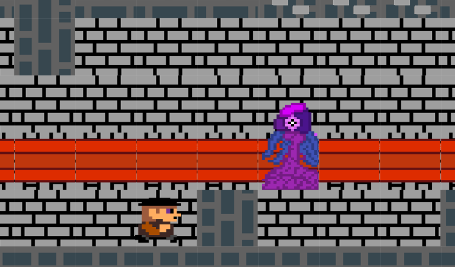
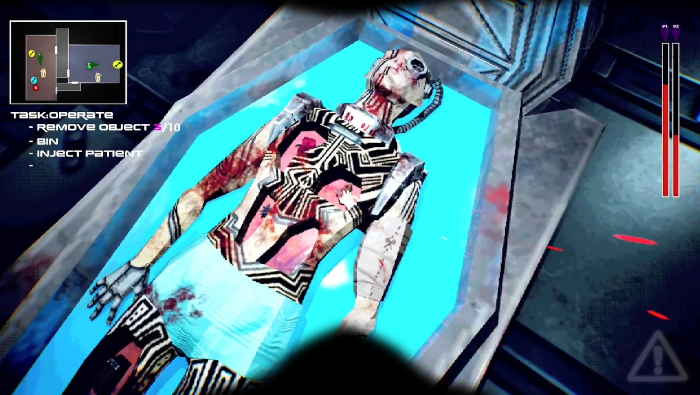

<html>

<head>  
<title>Ruadhán Ó Riabhaigh's Portfolio</title>
</head>

<body>

<h1 stlye="color:#c9bfbf"> Education projects </h1>

<h2 stlye="color:#c9bfbf"> CMP105 Games Programming Project - Crypt in the Gray </h2>

  
  
  
  
Made for 1st year University with SFML, released on Itch.io. Crypt in the Gray is a top-down, action, dungeon crawler based on The Legend of Zelda and Lovecraftian Horror.
    Everything but the music and sounds in the game were made by me, this game and idea are still a work in progress I would like to come back to and expand with more investigation and more in depth dungeon crawling.
   
    <a href="https://sleeepster.itch.io/crypt-in-the-grey"> Crypt in the Gray Itch.io Link</a>
  

  

  

      
  

 

<h2 stlye="color:#c9bfbf"> CMP208 Skateboard Project - DungeonVania </h2>

 Made for 2nd year University with a university in house engine called Skateboard. Dungeonvania is a side view action platformer with inspirations from Castlevania.
I had a focus on map and boss design and programming. Due to the nature of the project it is not accessible. 

<h2 stlye="color:#c9bfbf"> DES315 Professional Project - Operation:Operation </h2>

 
Made in a team for 3rd year University in Unreal Engine 5, released on Itch.io. Operation:Operation is a horror, stealth, puzzle game based on Alien Isolation and the board game Operation.
While there were many people in the team as well as another programmer, I focused on the UI programming and animation as well as the creature's AI and pathing.
 
<a href="https://kelpie-studios.itch.io/operation-operations">Operation:Operation Itch.io Link</a>

<h1 stlye="color:#c9bfbf"> Personal Projects </h1>

<h2 stlye="color:#c9bfbf">22CC - 22nd Century Crows</h2>

Currently being worked on in Godot game engine with the Dialogic Plugin. 22nd Century Crows is a dectective adventure game with visual novel, investigation and puzzle elements similar to games like Ace Attourney, Danganronpa and The Silver Case.
Working in duology with a friend, I am the solo programmer while my friend is the artist. The idea first came about when this friend posted a "mock game screenshot" based on old PC-98 games. After seeing it myself, I knew I wanted to help her realise her vison for the game and offered to program. Currently the project has basic functionality with the mechanics with not much practical aspects.

<h2 stlye="color:#c9bfbf">A Fools Errand</h2>

Currently being worked on in RPGMaker MZ. A Fools Errand is an rpg, focusing on combat, exploration and puzzles.
This has been an on and off work in progress inspired greatly by other games of the same type and genre, more specifically OFF, Hello Charlotte, Undertale as well as many others. RPGMaker is also a fun and simple engine to use when needing some downtime from more demanding projects.

<h2 stlye="color:#c9bfbf">Untitled Unreal Engine 5 project</h2>

A test build for different functions and ideas in unreal engine 5 including a dialogue system and the starts of a basic attack and inventory system.
I plan for this to either stay as a playground of sorts in unreal engine or to create a full project that can stand on it's own inspired by Drakengard.

<h2 stlye="color:#c9bfbf">Many more still in the planning stages</h2>

Since this portfolio is meant to showcase what I have currently, I will not show projects that have not been brought to code and are still in deep planning and working out some functionality and mechanics, this includes a tactics game, a fighting game, a management game as well as many many others.

</body>
</html>
